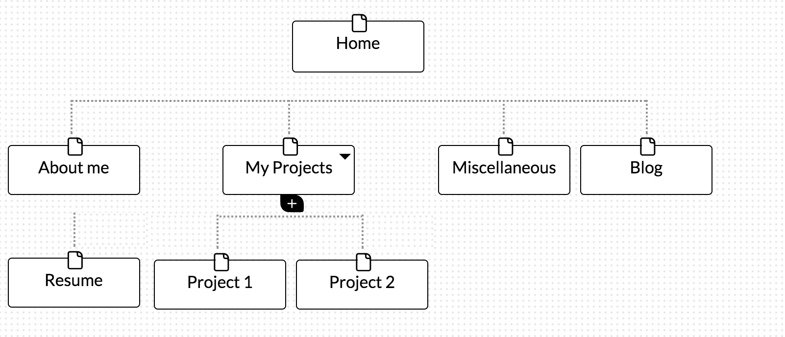

<!DOCTYPE html>
<html>

 <ul>
	<li>The six phases of website development are information gathering, planning, design, development, testing and delivery and maintenance.  </li>

	<li> My sites primary goal and purpose is to better help market myself to future employers. The content that my site will feature my current resume, a blog section, a page where employers can se my previous projects, an more about who I am.
</li>

	<li>My target audience interests are getting to know me better. My site address this by providing loads of content about myself and my work. 
 </li>

	<li> The primary action the users should take when coming to my site is navigating around my site, learning more about me, and contacting me if they are interested in interviewing me. I want users to see my portfolio and ultimately contact me if they’re interested. I believe that all visitors to the site will be of similar interests when coming to my sites. I do feel they may take many actions when viewing it, such as contacting me or sharing the website to other employers.
</li>

	<li> If your design and UX aren’t appealing to your users then you will lose traffic to your site and eventually business.
</li>

	<li>UX is the feeling users feel when coming to your site and navigate around it. UX is so valuable because if users aren’t feeling good about coming to your site, you will lose traffic. User experience can make or break a persons decision to come to your website. The more appealing a website is to users the higher chance they will make the decision to venture to your website.
 </li>

	<li> I did not really find any of the parts of the challenge tedious but rather very interesting.
</li>
</ul>

</html>