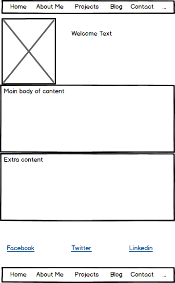
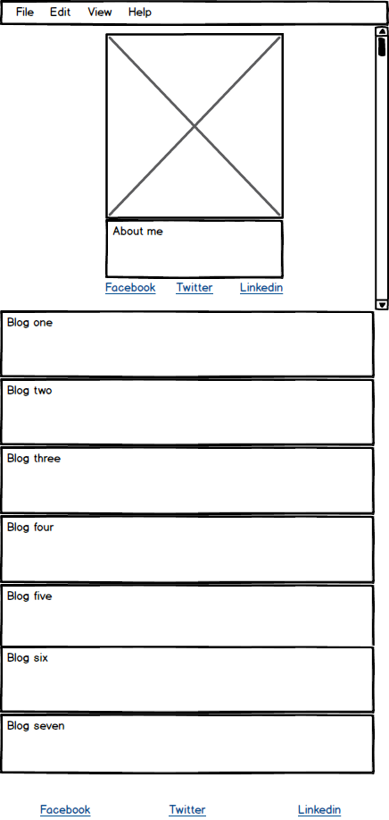

<!DOCTYPE html>
<html>

 <ul>
	<li>A wireframe is the architecture of a website that you design yourself. It gives you place holders on your webpage of which you can add content and determine what kind of content you are adding to a certain page holder. You are also able to customize the structure of these place holders to be things like images, textbooks, ect..
 </li>

	<li> The benefits of wire framing is it gives you the ability to see your websites layout. It also allows you to save a template so you don’t have to constantly create the same lay out for every web page. It’s also easy to test multiple different layouts rather quickly so you can make sure you are utilizing the best one. </li>

	<li>I did enjoy wire framing my website.
</li>

	<li>
I revised it a little bit too include more area where I could add content for my users to see </li>

	<li>I have actually worked with Wordpress before and used their wire framing tools. I didn’t have many questions working on the project because of my prior experience. The resources provided in the challenge about wire framing helped me answer any additional questions I had. </li>

	<li>I enjoyed the actual design process of the wire frame, particularly the dragging and dropping process. There weren’t any parts of this challenge that seemed tedious to me. </li>

</ul>

</html>